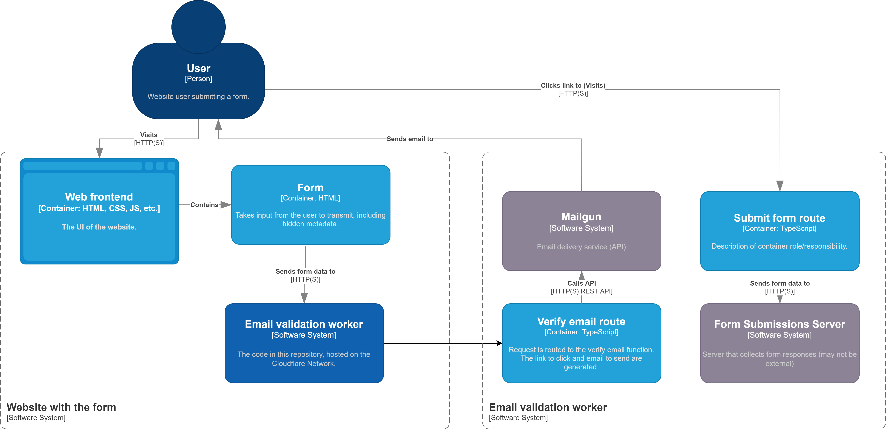

# Email Validation Worker (Mailgun)

Sits as middleware before a form submission to validate the email address.

You can use a service such as Formspree for getting form submissions, but you can't validate the email address before submitting the form. This worker sits in front of the form submission and validates the email address before submitting the form.

>**Note** This doesn't filter spam. Make sure to ratelimit properly and filter submissions on the server side. Additionally, this may be used to spam someone's inbox, which may be addressed in the future.

> **Warning** As of right now, links can be reused multiple times. See [#1](https://github.com/obfuscatedgenerated/cf-email-validator-worker/issues/1).

## Usage

(assuming you've set up Mailgun and your form submission service)

1. Clone this repo and install dependencies using `npm install` or `yarn install`.

2. Create a worker. You can use `wrangler generate` or create a new worker on the Cloudflare Dashboard.

3. Set up the secret (or environment) variables, using Cloudflare Dashboard, `wrangler secret put`, or .dev.vars file:

```
FROM_ADDRESS: The email address to send from (must match Mailgun domain, can have a name, e.g. "My Name <email@email.tld>" or just the email address)

MAILGUN_API_KEY: The API key for Mailgun
MAILGUN_API_BASE_URL: The base URL for the Mailgun API (not including the any path after or a trailing slash, e.g. `https://api.mailgun.net/v3/DOMAIN_HERE`)

SECRET_SIGNATURE: A long, random string used in hashing to verify submissions (note: hashtags may truncate the string in dev vars)

STORAGE_IMPLEMENTATION: The storage implementation to use
```

### Storage implementations

- `kv`: Cloudflare Workers KV (default)
- `do`: Cloudflare Durable Objects (not implemented yet, use kv for now)

Example values (.dev.vars format):
```ini
FROM_ADDRESS = "Mail Validator <email@mail.example.com>"

MAILGUN_API_KEY = "apikey123"
MAILGUN_API_BASE_URL = "https://api.mailgun.net/v3/mail.example.com"

SECRET_SIGNATURE = superlongrandomstring

STORAGE_IMPLEMENTATION = "kv"
```

4. (KV storage only) Create each KV namespace described in the `wrangler.toml` file using `wrangler kv:namespace create NAMESPACE_NAME` or the Cloudflare Dashboard.

5. Define the desired forms with the form definition tool: `npm run manage-forms` or `yarn manage-forms`. You can also enter the form definition manually into KV using a JSON format. See the type definition for [FormReference](./src/abstract_storage.ts) for a structure.

6. Deploy the worker using `wrangler publish` or the Cloudflare Dashboard.

7. Create an HTML form, using the worker's verify_email route as the action address.

Example HTML form:

```html
<form action="(worker url)/verify_email" method="post">
  <label for="email">Email address</label>
  <input name="Email" type="email">

  <button type="submit">Submit</button>

  <input name="EmailFieldName" value="Email" type="hidden"> <!-- set the value to the name of the email field -->
  <input name="FormKey" value="my form name" type="hidden"> <!-- set the value to the key for the intended form in FORM_KEYS_TO_URLS_JSON -->
  <input name="VerifyRedirectTo" value="https://example.com" type="hidden"> <!-- optional, set the value to where to redirect after going to /verify-email -->
  <input name="SubmitRedirectTo" value="https://example.com" type="hidden"> <!-- optional, set the value to where to redirect after going to /submit-form -->
</form>
```

Each of the hidden input values (except FormKey) can instead be defined in the form reference when you set it up. Any values in the form reference take precedence over the hidden inputs. This can be useful in reducing the repetition of similar forms, and in protecting the values from exposure or modification.

Example form where each value is defined in the form reference:

```html
<form action="(worker url)/verify_email" method="post">
  <label for="email">Email address</label>
  <input name="Email" type="email">

  <button type="submit">Submit</button>

  <input name="FormKey" value="my form name" type="hidden"> <!-- set the value to the key for the intended form in FORM_KEYS_TO_URLS_JSON -->
</form>
```

7. Profit! (and optionally create Worker Routes to the worker for /verify_email and /submit_form*)

## C4 Diagram


